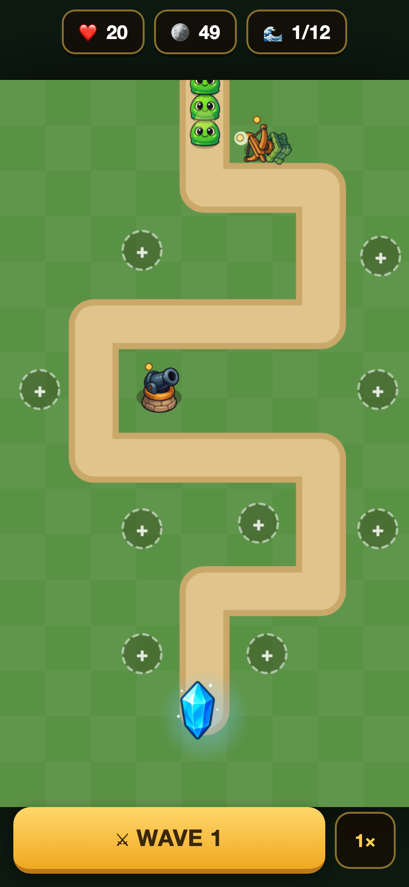

# 🛡️ Kingdom Guard

A compact, self-contained **tower-defense** game — pure HTML5 Canvas + JavaScript, no engine, no dependencies. Built to run offline on the web and as an Android app (Capacitor).

**Play:** _(web build — see repo homepage)_



## Features
- 3 tower types (Cannon · Archer · Frost), 4 upgrade levels each
- 4 enemy types (Slime · Runner · Tank · Boss) across 12 escalating waves
- Gold economy, tower sell/upgrade, 2× speed, win/lose
- Touch-first, portrait, safe-area aware
- **All art is original, AI-generated (copyright-free).**

## Run locally
```bash
cd www && python3 -m http.server 8123   # open http://localhost:8123
```

## Build Android (Capacitor)
The `www/` folder is the whole game. `npx cap sync android` bundles it into the APK for offline play.

## License
Code: MIT. Art: original generated assets, free to use.
